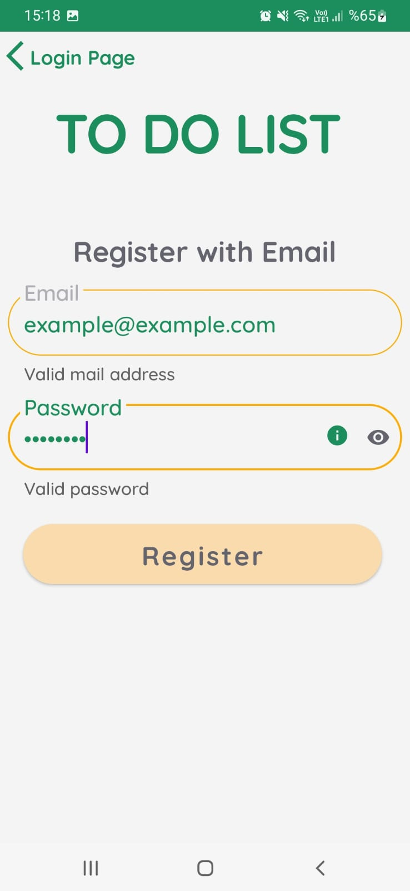
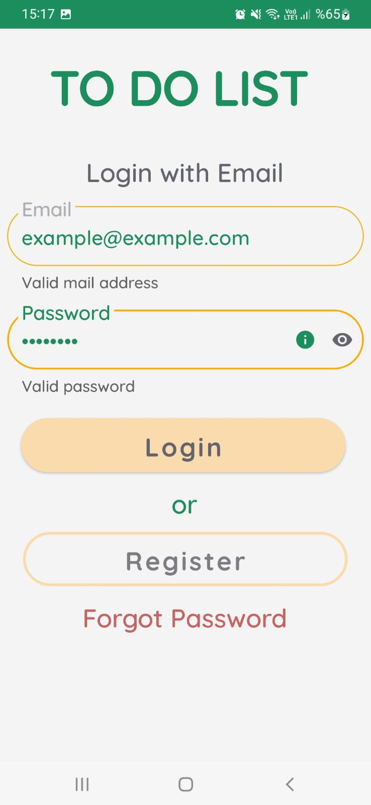
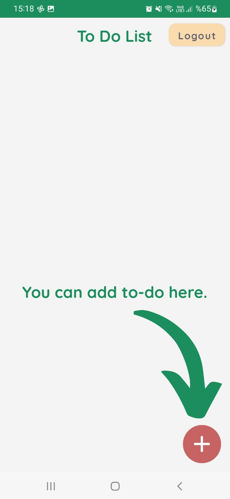
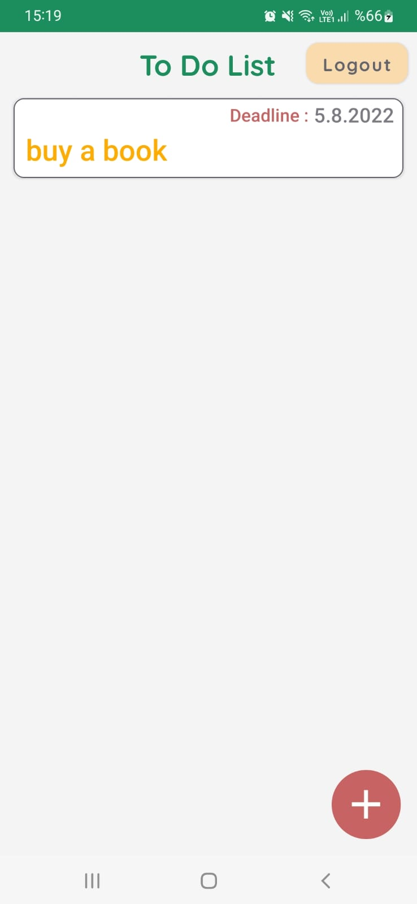
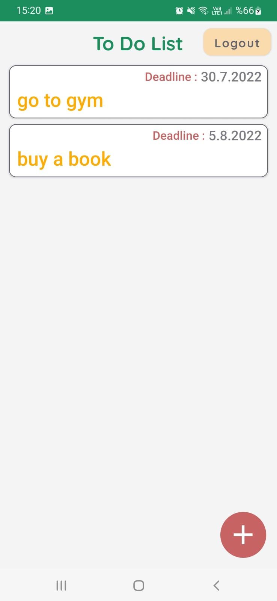
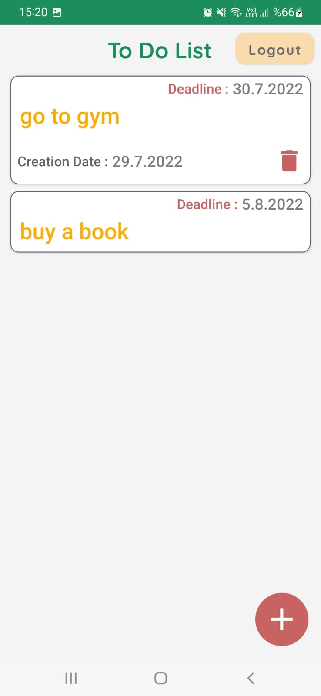

# todolist

### Project Information

- You can register with your email and password and login.

- You can use forgot password, we send a mail and include a link to reset your password.

-On the drop-down list page, you can add to-do from the button below.

-Added to-dos will appear in the list. When you click on it, the card expands and creation date and delete appear. Delete can be done with delete.

-You can logout from the top right. If you have not logged out, even if you close the application, the login screen will not appear, it will go directly to the screen with to-dos.

### Structures
-Firebase authentication and realtime database
-Recyclerview-Cardview
-Bottomsheet

 
<a id="raw-url" href="https://raw.githubusercontent.com/SefaKoyuncu/todolist/master/to-do-list.apk">Download APK Here</a>

------------
#### Screenshots
  
<table>
  <tr>
    <td></td>
    <td></td>
    <td></td>
      <td></td>
  </tr>
 </table>
 
  

<table>
  <tr>
  <td></td>
    <td></td>
    <td></td>
    <td></td>
  </tr>
 </table>
 
  

<table>
 
  <tr>
    <td></td>
    <td></td>
  </tr>
 </table>
 
  

------------

